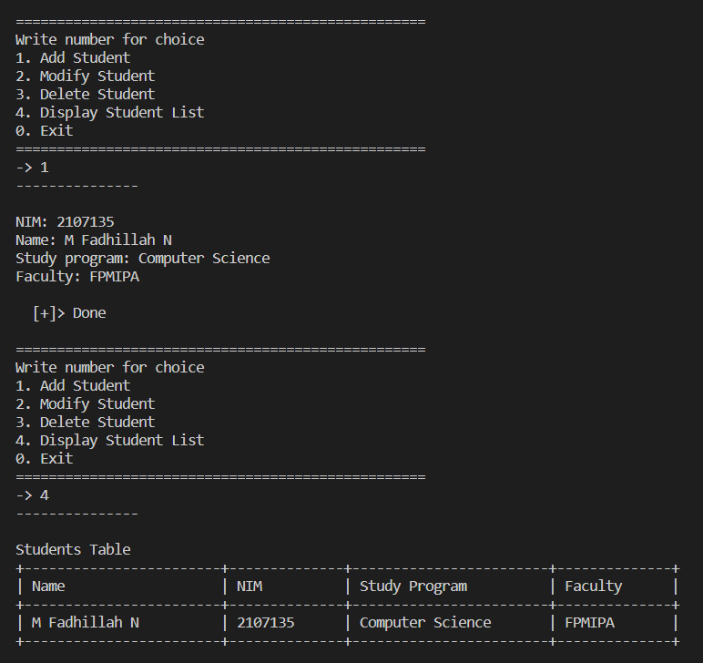
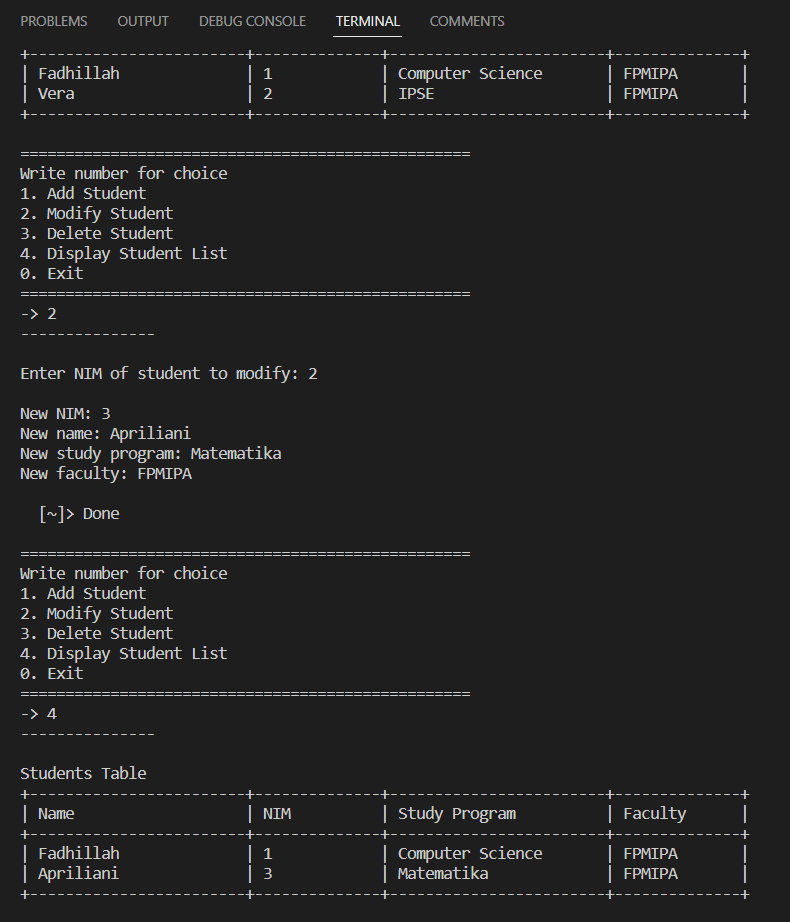

# LATIHAN1DPBO2023
Buatlah program berbasis OOP menggunakan bahasa pemrograman C++, Java, Python, dan PHP yang menampilkan informasi daftar mahasiswa (sekumpulan objek mahasiswa) dan memiliki fitur menambah, mengubah, dan menghapus data. Setiap mahasiswa memiliki data nama, NIM, program studi, fakultas, dan foto profil (khusus bahasa PHP).

---
- - 
Saya Muhammad Fadhillah Nursyawal NIM 2107135 mengerjakan soal Latihan 1 dalam mata kuliah Desain Pemrograman Berorientasi Objek untuk keberkahanNya maka saya tidak melakukan kecurangan seperti yang telah dispesifikasikan. Aamiin.


## Desain Program
Program dibuat dalam bahasa `C++`, `Java`, `Python`, dan `PHP`. tiap bahasa mempunyai desain program yang sama. Program berisi beberapa file kelas diantaranya:
1. **Student** > kelas mahasiswa
2. **CRUDStudent** > kelas fitur 
3. **Table** > kelas tabel, untuk membuat dan menampilkan tabel  

terakhir diikuti dengan file `main.` pada program.

Tiap kelas memiliki atribut dan methodnya masing masing

### Atribut
1. **Student**
    - `NIM` > NIM mahasiswa
    - `name` > nama mahasiswa
    - `prody` > program studi mahasiswa
    - `facilty` > fakultas mahasiswa  
    *atribut bertipe data `string`*

2. **CRUDStudent**
    - `students` > list untuk menampung data mahasiswa `vector`

3. **Table** > untuk kelas Table tidak memiliki atribut

### Method
1. **Student**
    - `student` > konstruktor memiliki atribut agar langsung diisi ke variabel
    - `displayStudentInfo` > untuk menampilkan data mahasiswa  
    sisanya merupakan method setter dan getter tiap atributnya 
2. **CRUDStudent**
    - `addStudent` > menambahkan data input mahasiswa ke list
    - `modifyStudent` > mengubah data mahasiswa di list
    - `deleteStudent` > menghapus data mahasiswa dari list
    - `displayStudentList` > menampilkan data mahasiswa berupa tabel
    - `getCheckNIM` > untuk check nim yang sama
3. **Table** 
    - `border` > untuk menampilkan border
    - `border2` > sama saja tapi beda versi
 
**catatan** : *display data menggunakan pola tabel untuk menampilkan data mahasiswa pada method `displayStudentList` dan `displayStudentInfo`.*

### Error Handling
- Saat ingin add data, `NIM` akan di check dengan `list`, jika data redundan maka akan menampilkan pemberitahuan
```
[!]> NIM is already in the list <[!]
```
- saat ingin mengubah data, `NIM` yang akan diubah di check dengan `list`, jika tidak ada dalam `list` maka akan menampilkan pemberitahuan
- begitupun saat ingin menghapus, prosesnya juga sama

Dalam main akan menampilkan menu untuk memilih apa yang kita inginkan:
```
1. Add Student
2. Modify Student
3. Delete Student
4. Display Student List
0. Exit
```


## Penjelasan Alur
Setiap bahasa mempunyai Alur program yang sama. Setelah melakukan execute program, sistem akan menampilkan menu
```
1. Add Student > menambahkan data mahasiswa
2. Modify Student > mengubah data mahasiswa
3. Delete Student > menghapus data mahasiswa
4. Display Student List > menampilkan data mahasiswa dengan tabel
0. Exit > keluar
```
lalu user menginput pilihan menu yang di inginkan. Jika user memilih `-> 1` maka user diminta untuk menginputkan `NIM` mahasiswa terlebih dahulu, NIM akan di check dengan list, jika tidak ada di list maka lanjut user menginput
```
Name: [Nama]
prody: [Program Studi]
faculty: [Fakultas]
```
lalu data berhasil ditambahkan. jika user memilih `-> 4` sistem akan menampilkan data mahasiswa berupa `tabel` (tabel terlampir dalam dokumentasi).

jika user memilih `-> 2` maka user diminta untuk menginput `NIM` yang akan diubah datanya. NIM di check, jika ada dalam list maka user diminta untuk menginput data yang baru.

jika user memilih `-> 3` maka user diminta untuk menginput `NIM` yang akan dihapus datanya.


## Dokumentasi Execute Program (C++)
- Add student data dan display

- Modify student data

- Screen record ->
[RUN C++](img/main.cpp%20-%20code%20-%20Visual%20Studio%20Code%202023-02-15%2019-59-51.mp4)